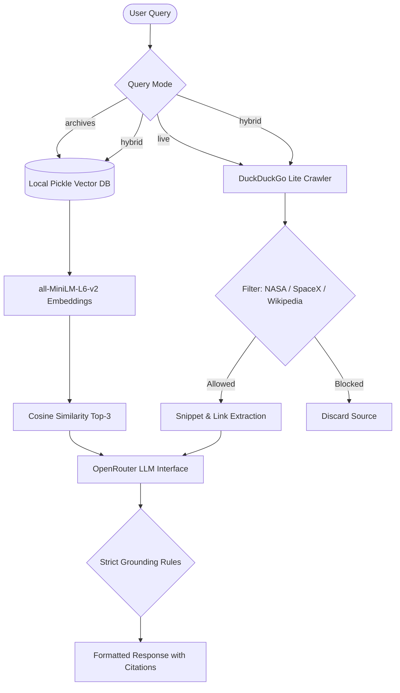

# SpaceY: Advanced RAG-Powered Aerospace Intelligence

SpaceY is a high-performance intelligence portal designed for space exploration, aerospace engineering, and planetary sciences. The platform integrates a local Retrieval-Augmented Generation (RAG) vector repository, a live web crawler restricted to credible research sources, and a modern Next.js developer portal and API playground.

---

## 🌌 System Architecture

The SpaceY engine acts as a unified interface to resolve queries using different data retrieval strategies:



---

## 🗄️ Retrieval-Augmented Generation (RAG) System

The core of SpaceY's intelligence engine is a highly efficient offline semantic retrieval system:

- **Local Vector Repository**: The RAG database is serialized into a lightweight, high-speed binary format at [RAG_model.pkl](file:///c:/Users/HP/Desktop/temp%20storage/SpaceY/model/RAG_model.pkl). It contains over **1.2K segmented, high-dimensional document chunks** extracted from historical archives.
- **Data Coverage**: Contains exhaustive logs and technical specifications covering:
  - **Starship**: Development history, orbital flight tests (IFT-1 to IFT-4), Raptor engine specs, and thermal protection systems.
  - **Falcon 9**: Booster reuse history, Merlin engine parameters, payload capabilities, and landing stats.
  - **Voyager 1 & Voyager 2**: Launch details, instrument specifications, planetary flybys, and interstellar telemetry.
- **Embedding Pipeline**: Leverages the sentence-transformers model `all-MiniLM-L6-v2` to compute 384-dimensional dense vector representations of documents.
- **Similarity Search**: Employs cosine similarity mapping (`sklearn.metrics.pairwise.cosine_similarity`) to match query embeddings against the vector space, retrieving the top 3 most relevant segments.

---

## 🔍 Credible Web Search & Live Research

When up-to-the-minute data is required, SpaceY spins up a live research crawler designed to extract facts only from peer-reviewed or authoritative portals:

- **DuckDuckGo Lite Crawler**: Uses a lightweight POST search protocol targeting `https://lite.duckduckgo.com/lite/` to bypass heavy client-side scripts and retrieve search listings quickly.
- **Strict Domain Restrictions**: To prevent hallucination and the ingestion of unverified blogs or social media data, the crawler enforces domain restriction:
  - Allowed sites: `nasa.gov`, `spacex.com`, and `wikipedia.org`.
  - The query is strictly rewritten: `(site:nasa.gov OR site:spacex.com OR site:wikipedia.org) <user_query>`.
  - The crawler parses the HTML results using regex patterns to isolate titles, links, and snippets, discarding any results that do not match the authorized domains.
- **Strict LLM Grounding Rules**: The prompt enforces strict RAG parameters on the model (`poolside/laguna-xs.2:free` via OpenRouter):
  1. Rely **ONLY** on the provided context; outside information is banned.
  2. Maximum length of **150 words**.
  3. If information is missing, respond exactly with: `"I could not find enough information in the provided documents."`
  4. Always append a unique list of verified sources at the end.

---

## 💻 Developer Portal & API Playground

The application provides a sleek Next.js developer portal accessible at `/developer` that serves as a control center and API dashboard:

- **Unified API Endpoint**: Exposes a developer-friendly HTTP POST endpoint `/api/chat` to integrate SpaceY intelligence.
- **Request Payload**:
  ```json
  {
    "message": "When was Voyager 1 launched?",
    "mode": "hybrid"
  }
  ```
  *Where `mode` can be `"archives"` (local vector search), `"live"` (filtered web search), or `"hybrid"` (combined context).*
- **Response Schema**:
  ```json
  {
    "answer": "Voyager 1 was launched on September 5, 1977, by NASA from Launch Complex 41 at the Cape Canaveral Air Force Station...\n\nSources: NASA, SpaceY Archives",
    "sources": ["NASA", "SpaceY Archives"]
  }
  ```
- **External Dataset Registry**: Under the hood, the portal lists and integrates 20+ connected external datasets cataloged in [database.json](file:///c:/Users/HP/Desktop/temp%20storage/SpaceY/web/src/app/developer/database.json), providing deep links and metadata for:
  - JPL Near Earth Objects (NEOs)
  - APOD (Astronomy Picture of the Day)
  - HiRISE Mars Surface Imaging Catalogue
  - Global geospatial hydrological and wildfire trackers
  - NOAA & NASA Global Land-Ocean temperature records

---

## 🚀 Getting Started

### Prerequisites

- Python 3.10+
- Node.js 18+
- An OpenRouter API Key configured in your environment

### Setup & Installation

1. **Clone & Setup Python Environment**:
   ```bash
   # Create a virtual environment
   python -m venv .venv
   source .venv/bin/activate  # On Windows: .venv\Scripts\activate
   
   # Install dependencies
   pip install -r requirements.txt
   ```

2. **Configure Environment Variables**:
   Create a `.env` file in the root directory:
   ```env
   OPENROUTER_API_KEY=your_openrouter_api_key
   OPENROUTER_API=https://openrouter.ai/api/v1/chat/completions
   ```

3. **Query via CLI**:
   Execute RAG queries directly from the command line:
   ```bash
   python query.py "What is the landing history of Falcon 9 booster B1058?" archives
   ```

4. **Run the Next.js Web Portal**:
   ```bash
   cd web
   npm install
   npm run dev
   ```
   Open `http://localhost:3000` to interact with the Chat Interface and the Developer Portal.
